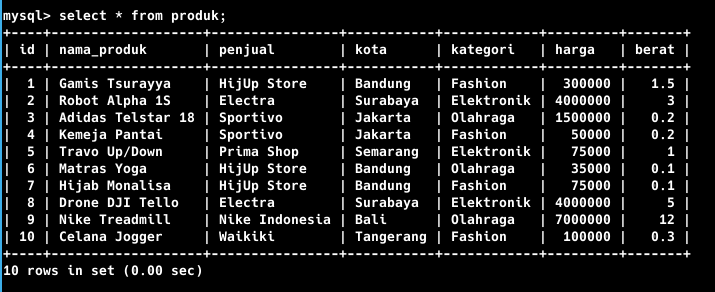
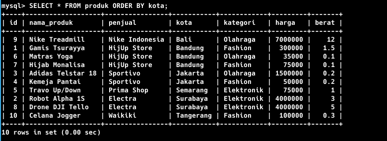
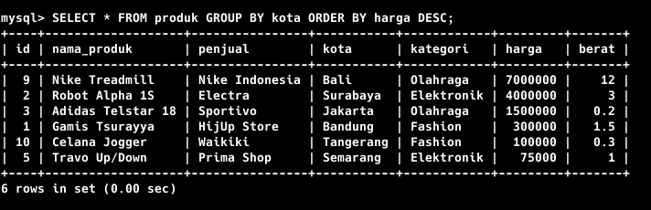
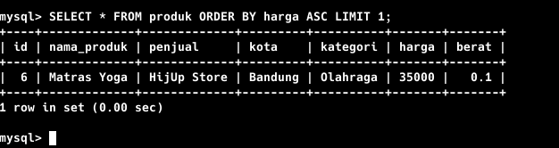

# MySQL Database Test

Ini adalah jawaban dari soal test yang terdapat pada soal yang terlampir pada [[ SOAL ]](https://github.com/gdevilbat/Ujian_Backend_Ajita_05#soal-1---mysql-database)

1. Tuliskan langkah-langkah/urutan query MySQL untuk membuat sebuah database "Toko" yang memiliki tabel "Produk" dengan data sebagai berikut:



<p style="text-align:center">Hasil Dari Soal Nomer 1</p>

<p>Query :</p> 

```sql
SELECT * FROM produk
```

2. Dari tabel "Produk" di database "Toko", tuliskan query MySQL untuk menampilkan seluruh data, dikelompokkan berdasarkan kolom kota. Hasil yang diharapkan sebagai berikut:



<p style="text-align:center">Hasil Dari Soal Nomer 2</p>

<p>Query :</p> 

```sql
SELECT * FROM produk ORDER BY kota ASC
```

3. Dari tabel "Produk" di database "Toko", tuliskan query MySQL untuk menampilkan data produk dengan harga tertinggi di setiap kota, kemudian diurutkan berdasarkan kolom harga. Hasil yang diharapkan sebagai berikut:



<p style="text-align:center">Hasil Dari Soal Nomer 3</p>

<p>Query :</p> 

```sql
SELECT * FROM produk GROUP BY kota ORDER BY harga DESC
```

4. Dari tabel "Produk" di database "Toko", tuliskan query MySQL untuk menampilkan data produk dengan harga terendah. Hasil yang diharapkan sebagai berikut:



<p style="text-align:center">Hasil Dari Soal Nomer 4</p>

<p>Query :</p> 

```sql
SELECT * FROM produk ORDER BY harga ASC LIMIT 1
```
